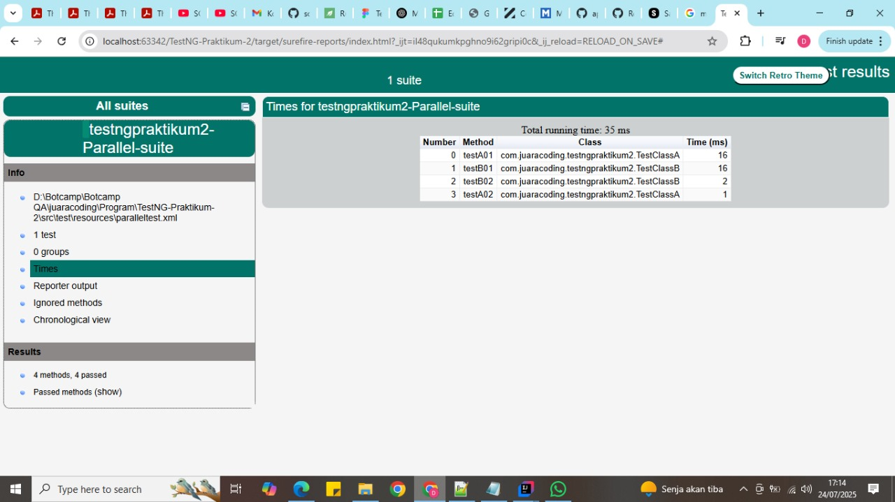

Performance Sequential vs Parallel 
--

Buat riset sederhana tentang tingkat paralel pada suatu test.

1. Berikan laporan time (waktu) jika ada 2 atau lebih test menggunakan sekuensial.
2. Berikan laporan time (waktu) jika ada 2 atau lebih test menggunakan paralel.
3. Berikan insight dari kedua hasil tersebut.

Langkah Pembuatan
--
1. membuat 2 class yang saya beri nama:TestClassA & TestClassB
2. di setiap masing-masing class, diberikan 4 method pegujian sederhana
3. diberikan juga tiap masing-masing method berupa thread sleep = 3000
4. buat folder/package resources di folder test 
5. buat testng.xml pada folder/package resources
6. buat sequencetest.xml yang berisi sequence dan 
7. buat paralleltest.xml untuk parallel nya
7. atur bagian pom.xml nya menambahkan maven testng, dan tambahkan
   <suiteXmlFile>src/test/resources/sequencetest.xml</suiteXmlFile>
   <suiteXmlFile>src/test/resources/paralleltest.xml</suiteXmlFile>
8. jika sudah, maka dapat dijalankan melalui terminal jika menggunakan vscode
9. jika dijalankan menggunakan intiliej maka bisa memilih sidebar kiri maven, klik clean & test secara bersamaan, lalu klik run
10. untuk menjalankan dibagian pom nya, di setting, yg mana mau dijalankan dulu, sequence atau parallel nya
11. untuk melihat report, bisa ke folder target, cari "surefire-reports" dan pilih index.html, open with browser
12. maka akan terlihat perbandingannya dibawah berikut

Hasil Pengujian
--
1. Sequential: dari gambar berikut dapat ditarik kesimpulan bahwa "total running time = 23 ms"
dengan method A01 = 17ms, A02 = 3ms, B01 = 2ms, B02 = 1ms.

2. Parallel: dari gambar berikut dapat ditarik kesimpulan bahwa "total running time = 35 ms"
   dengan method A01 = 16ms, A02 = 16ms, B01 = 2ms, B02 = 1ms. dengan thread.count = 2

Kesimpulan
--

1. Sequnce akan berjalan sesuai urutan, namun parallel bisa berjalan bersamaan di thread yang berbeda,
terlihat waktu eksekusi nya ada yg sama di parallel, maka penggunaan parallel sudah benar
2. Parallel tidak selalu lebih cepat
banyak faktor kenapa ini bisa terjadi, bisa karna ram pc user atau overhead dari pembentukkan dan pengelolaan thread
3. parallel cocok untuk menjalankan banyak test case, sehingga mempercepat total waktu testing secara signifikan
